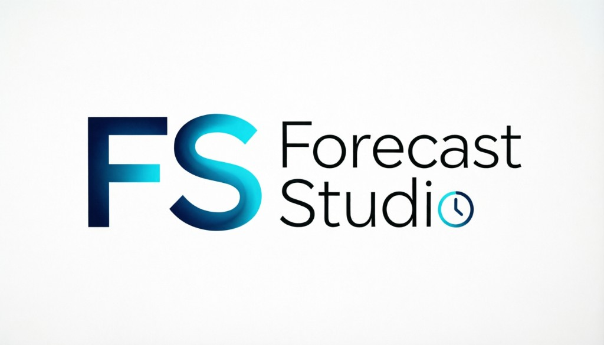

<div align="center">
  
</div>

# Forecast Studio

Deployable forecasting and analytics platform for teams: multi-agent orchestration (LangGraph), FastAPI backend and Next.js UI, with optional Dagster pipelines, MLflow tracking, and Great Expectations for data quality.

## Quick start (Docker)

```bash
cp .env.example .env
# Set LLM_API_KEY (or legacy DEEPSEEK_API_KEY) and optional LLM_BASE_URL / LLM_MODEL

docker compose up -d   # core app + Postgres/Redis + MLflow + Dagster
# optional Langfuse (observability):
make local-up
```

- Frontend: http://localhost:3000
- Backend API: http://localhost:8000 (OpenAPI: `/docs`)
- MLflow: http://localhost:5000 (if `:5000` is busy — e.g. macOS AirPlay — set `MLFLOW_HOST_PORT=5001` in `.env` and run `docker compose up -d --build`)
- Dagster UI: http://localhost:3005
- Langfuse (only with `make local-up` / `--profile observability`): http://localhost:3001

`NEXT_PUBLIC_MLFLOW_URL` / `NEXT_PUBLIC_DAGSTER_URL` are set in Compose for the frontend image so you can embed or link them (e.g. Scheduling) without reinventing those UIs.

## Quick start (local dev, no Docker for app code)

```bash
uv sync --all-packages --group dev
cp .env.example .env

# Terminal 1 — API
cd backend && uv run uvicorn app.main:app --reload --port 8000

# Terminal 2 — UI
cd frontend && npm install && npm run dev
```

Open http://localhost:3000. The frontend expects the API at `http://localhost:8000` (see `NEXT_PUBLIC_API_URL` in compose / frontend env).

## Features

- **File upload** — CSV or Excel time series
- **Chat** — OpenAI-compatible LLM (configure via `LLM_*` env; legacy `DEEPSEEK_*` still supported)
- **Auto-detection** — Date and value columns
- **Forecasting** — Multiple models (naive, linear, LightGBM, Prophet, …)
- **Configuration** — Column selection and forecast horizon

## Architecture

```
┌─────────────────────────────────────────────────────────────┐
│                    NEXT.JS FRONTEND                         │
│  Chat · uploads · charts · auth                           │
└─────────────────────────────────────────────────────────────┘
                            │
                            ▼
┌─────────────────────────────────────────────────────────────┐
│              FASTAPI + CELERY (backend)                     │
│  Sessions · jobs · forecaster library                       │
└─────────────────────────────────────────────────────────────┘
                            │
            ┌───────────────┼───────────────┐
            ▼               ▼               ▼
┌───────────────┐  ┌───────────────┐  ┌───────────────┐
│  CHAT AGENT   │  │  DATA AGENT   │  │  MODEL AGENT  │
│ (LLM tools)   │  │ (analysis)    │  │ (training)    │
└───────────────┘  └───────────────┘  └───────────────┘
```

## Usage (UI)

1. **Upload** a CSV with a date column and numeric targets
2. **Configure** date and target columns
3. **Chat** to run forecasts or inspect data
4. **View** charts and tables in the app

### Example chat commands

- "Zrób prognozę na 14 dni"
- "Prognozuj kolumnę sales"
- "Ustaw horyzont na 30 dni"
- "Jakie modele są dostępne?"

## Data format

- A date column (e.g. `date`, `timestamp`)
- One or more numeric columns to forecast

Example:

```csv
date,sales,expenses
2024-01-01,100,50
2024-01-02,120,60
```

## Project structure

```
forecast-studio/
├── packages/forecaster/      # Core ML + LangGraph library
├── backend/                  # FastAPI + Celery
├── frontend/                 # Next.js
├── orchestration/            # Dagster (fs_orch)
├── infra/                    # Azure Bicep
├── pyproject.toml            # uv workspace root
└── uv.lock
```

## Development

### CLI forecaster (no server)

```bash
uv run python -m forecaster.main example_data.csv "Forecast next 7 days"
```

### Tests and formatting

```bash
make test-backend
make lint
cd backend && uv run mypy app/ --ignore-missing-imports
```

### Dagster (local process)

```bash
uv run dagster dev -m fs_orch.definitions
```

### MLflow (Docker)

Included in the default stack (`docker compose up -d`). Tracking URI: http://localhost:5000
(`make local-dataops` only ensures the MLflow container is running.)

## Configuration

See [CONFIG.md](./CONFIG.md) for `LLM_*` variables, legacy provider keys, Langfuse, and database settings.

## Agents

The platform uses a multi-agent architecture:

- **Chat agent** — Interprets intent and tool calls
- **Data agent** — Analyzes uploads and columns
- **Model agent** — Selects models and runs forecasts

## Roadmap

- [ ] More models (ARIMA, …)
- [ ] Confidence intervals
- [ ] Export forecasts
- [ ] Session history
- [ ] Multiple time series
- [ ] Feature engineering

## License

MIT
